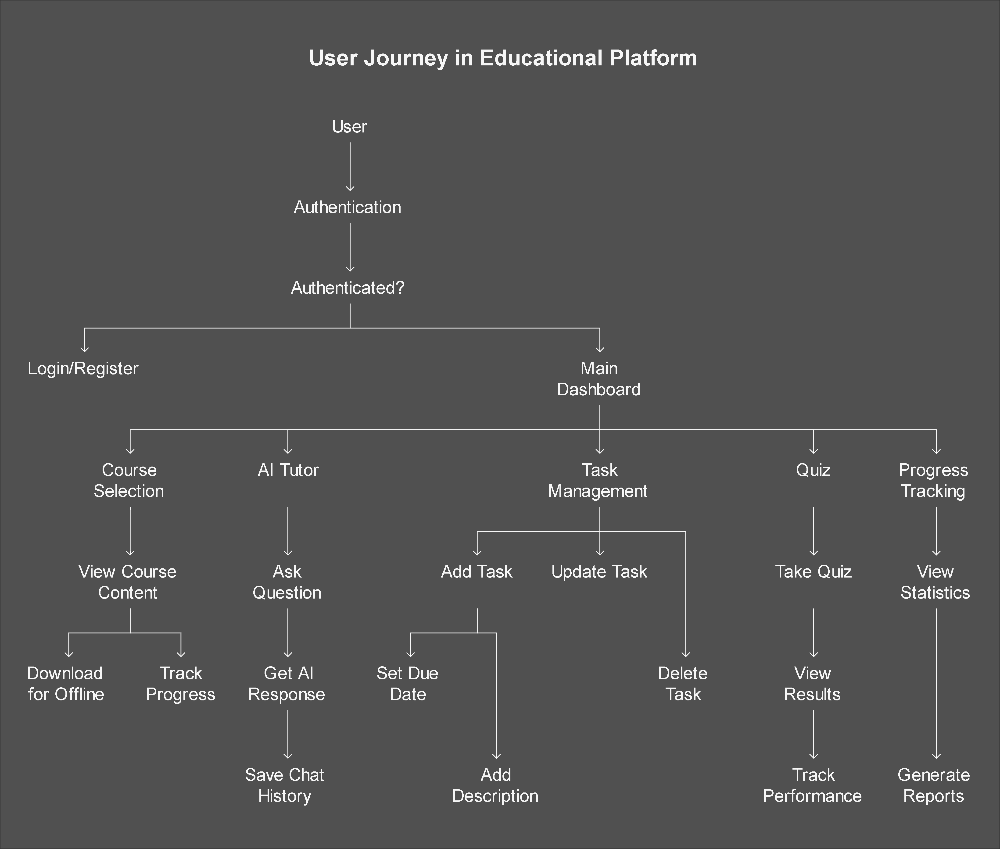

# 📚 EduReach – AI-Powered Learning Companion  

EduReach is an AI-powered educational app designed to enhance learning efficiency through interactive courses, quizzes, task management, and personalized progress tracking. Whether you're a student or a lifelong learner, EduReach provides a structured way to improve your skills and knowledge.

## 🚀 Features  

✅ **AI Tutor** – Get instant topic summaries, concept explanations, and learning resources with the Gemini AI integration.

✅ **Chat History** – Save and access your previous AI Tutor interactions for easy reference.

✅ **Response Length Options** – Choose between Brief, Summary, or Long responses based on your needs.

✅ **Markdown Formatting** – Enjoy well-formatted educational content with proper headings, lists, and emphasis.

✅ **Interactive Quizzes** – Test your knowledge with engaging quizzes.  
✅ **Task Management** – Organize and track your learning tasks with due dates, descriptions, and completion status.  
✅ **Progress Tracking** – Monitor your learning journey with visual progress bars.  

✅ **Course Selection** – Choose from multiple subjects like AI, Python, Science, and more.  

✅ **User Profile** – Customize your learning experience with a personal profile.  

✅ **Offline Support** – Access content even without an internet connection.  
✅ **Lesson Progression** – Unlock new lessons as you complete previous ones.  
✅ **Secure Task Storage** – All tasks are securely stored and only accessible to their creator.

---

## 🛠 Tech Stack  

- **Frontend:** Jetpack Compose (Android UI)  
- **Backend:** Firebase   
- **AI Integration:** Google Gemini 2.0 Flash API
- **Local Database:** Room Database
- **Remote Database:** Firestore  
- **UI Component Library:** Material 3
- **Development Assistance:** Gemini flash 2.0 and Claude 3.7 Sonnet (Used for faster and optimized coding)

---

## 📷 Screenshots  
| Welcome | Registration | Login | Forget Password | Profile |
|------|--------|------|------|---------|
|  |  |  |  |  |

| Home | Courses | AI Tutor | Quiz | Task | Progress |
|------|--------|---------|------|------|---------|
|  |  |  |  |  |  |

---
##  🚀Flow Diagram

---
## 🆕 Version History


### v1.4.0 (Current)
- Added personalized learning style assessment and adaptation *EduWise*
- Implemented multiple AI personality modes (Supportive, Challenging, Socratic)
- Enhanced session management with multiple chat sessions
- Added study recommendations based on learning style
- Improved UI with Material You dynamic theming
- Optimized app performance and reduced memory usage


### v1.3.0 
- Implemented enhanced Task Management system with cloud storage
- Added secure Firebase authentication for tasks
- Added comprehensive lesson progression system with dependencies
- Implemented user-friendly error handling and feedback
- Added date selection for task due dates
- Improved UI for task management

### v1.2.0
- Added chat history storage with Room Database
- Implemented advanced AI Tutor with Gemini 2.0 Flash API
- Added response length options (Brief, Summary, Long)
- Improved content formatting with Markdown support
- Enhanced UI components and responsiveness

### v1.1.0
- Added offline support
- Improved UI/UX design
- Fixed various bugs and performance issues

### v1.0.0
- Initial release with core features

---

## 🏗 Installation

1. Clone the repository:
   ```bash
   git clone https://github.com/yourusername/EduReach.git
   ```

2. Open the project in Android Studio

3. Set up configuration files:
   - Copy `local.properties.example` to `local.properties` and add your SDK path:
     ```
     sdk.dir=YOUR_ANDROID_SDK_PATH
     ```
   - Add your Gemini API key to `local.properties`:
     ```
     geminiApiKey=YOUR_API_KEY
     ```
   - Copy `app/google-services.json.example` to `app/google-services.json` and update with your Firebase configuration:
     - Create a Firebase project at [Firebase Console](https://console.firebase.google.com)
     - Add your Android app to the project
     - Download the `google-services.json` file from Firebase Console
     - Replace the placeholder values in `app/google-services.json` with your actual Firebase configuration

4. Configure Firebase:
   - Set up Firestore security rules as described in the documentation
   - Enable Authentication methods you want to use
   - Configure Firebase Storage if you plan to use it

5. Build and run the application

---

## 💡 How to Contribute  

1. **Fork the repository** 🍴  
2. **Create a new branch** 🌿  
   ```bash
   git checkout -b feature-branch
   ```
3. **Make your changes** 🛠  
4. **Commit the changes** ✅  
   ```bash
   git commit -m "Added new feature"
   ```
5. **Push to GitHub** 🚀  
   ```bash
   git push origin feature-branch
   ```
6. **Create a Pull Request** 🔥  

---

## 🎖 Developed by Team Knights  
EduReach is proudly developed by **Team Knights**, a passionate group of developers dedicated to building innovative educational solutions.  

💡 Join us in shaping the future of AI-driven learning!  

## 👥 Team Members (Team Knights)  
- [**Abhishek Maurya**](https://github.com/abhishek-maurya576) – Project Lead & Android Developer
- [**Shivank Rastogi**](https://github.com/shivank638815) – UI/UX Designer  
- [**Kumar Manglam**](https://github.com/KManglam) – Firebase & Database Manager  

---

## 📜 License  
This project is **open-source** and available under the [**MIT License**](LICENSE).  

---

## 💬 Connect With Me  
📧 Email: maurya972137@gmail.com  
🔗 [GitHub](https://github.com/abhishek-maurya576) | [LinkedIn](https://www.linkedin.com/in/abhishekmaurya9118) | [YouTube](https://youtube.com/@bforbca)  

👨‍💻 Feel free to explore, contribute, and enhance the EduReach experience! 🚀

